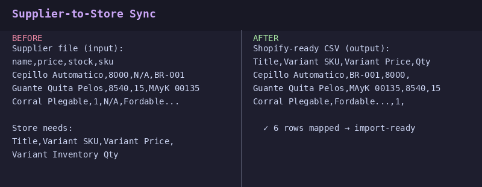

# Supplier-to-Store Sync

**Convert supplier price lists into Shopify/WooCommerce import files — automatically.**

Your supplier sends you an Excel with 500 products. Your store needs a specific CSV format to import them. Manually mapping columns and reformatting every time is error-prone and slow.

This tool takes your supplier's file, maps it to your store's format, and generates a ready-to-import CSV — no copy-pasting required.

## Before → After



## How it works

```
Supplier Excel/CSV → mapping config → Shopify CSV or WooCommerce CSV
```

## Quick start

```bash
pip install -r requirements.txt

# Use the built-in mapping template
python sync.py sample_data/supplier_inventory.xlsx --template shopify

# Or use a custom mapping file
python sync.py sample_data/supplier_inventory.xlsx --mapping my_mapping.json
```

## Output

A CSV ready to import via Shopify's admin panel or WooCommerce's CSV import tool.

## Example mapping

The tool comes with default mappings for:
- **Shopify** → `Handle`, `Title`, `Body (HTML)`, `Variant SKU`, `Variant Price`, `Variant Inventory Qty`
- **WooCommerce** → `ID`, `Name`, `SKU`, `Price`, `Stock`

Add your own mapping with a simple JSON file:

```json
{
  "Title": "nombre",
  "Variant SKU": "sku",
  "Variant Price": "precio_dropshipping",
  "Variant Inventory Qty": "stock"
}
```

## Use case

You get a weekly price list from your supplier. Instead of reformatting it manually, you run one command and get a file ready to import into your store.

---

**Tech stack:** Python · pandas · openpyxl
